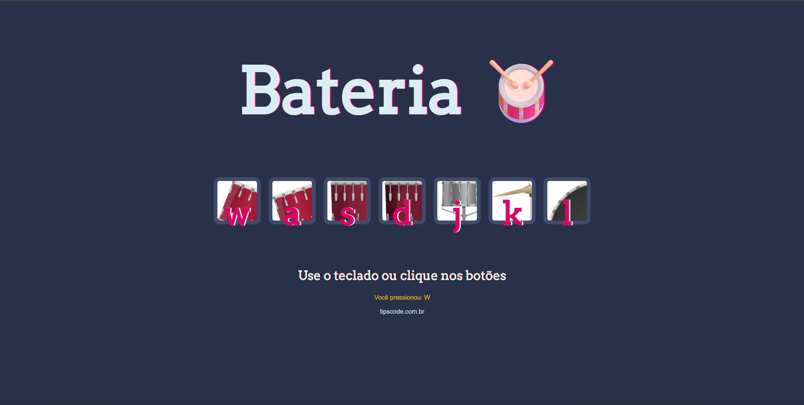
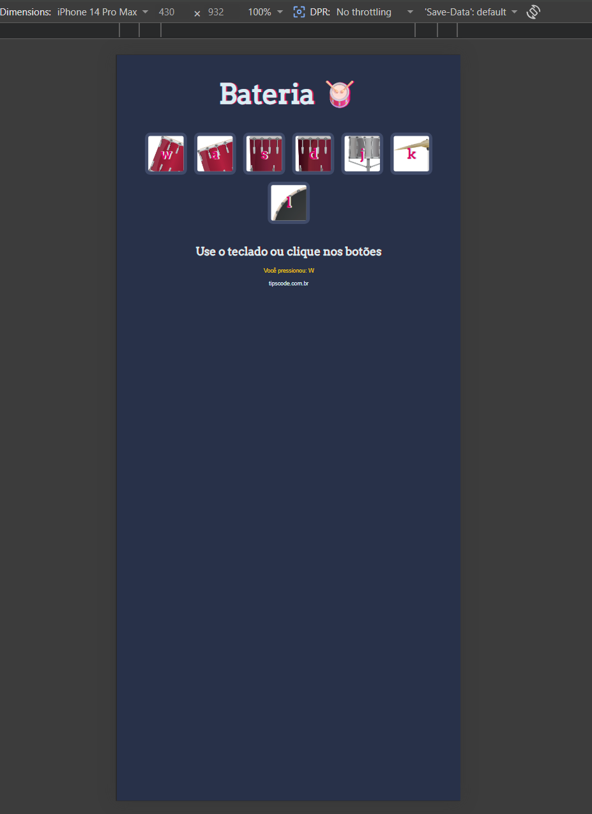

# 🥁 Drum Kit

Projeto interativo de bateria desenvolvido com HTML, CSS e JavaScript.  
Você pode tocar sons usando o teclado ou clicando nos botões.

---

## 🌐 Acesse o projeto

👉 [Clique aqui para jogar o Drum Kit](https://maiconsouzazzss.github.io/drum-kit/)

---

## 🚀 Funcionalidades

- Clique nos botões para tocar sons
- Suporte ao teclado (W A S D J K L)
- Animação visual nos botões ao pressionar
- Feedback na tela mostrando a tecla usada
- Layout responsivo (desktop e mobile)

---

## 🛠 Tecnologias

- HTML
- CSS
- JavaScript (DOM, eventos e lógica)

---

## 📸 Preview

### 💻 Versão Desktop

### 📱 Versão Mobile

---

## 📚 Aprendizados

- Manipulação do DOM com JavaScript
- Eventos de clique e teclado
- Uso de funções para organização do código
- Feedback visual dinâmico na interface
- Responsividade com CSS

---

## 👨‍💻 Autor

Maicon de Souza